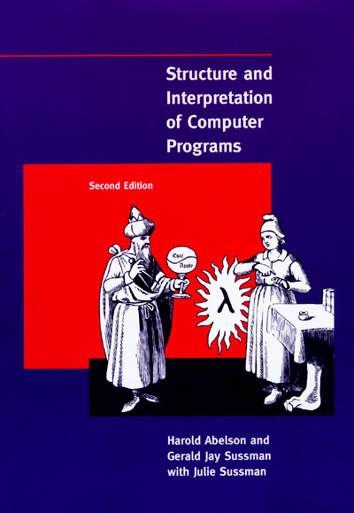

# Книга и курс Structure and Interpretation of Computer Programs

[Книга](https://mitpress.mit.edu/sicp/full-text/book/book.html) на сайте MIT. Есть где-то в сети хороший русский перевод.

## Оригинальные видеолекции на английском
* [Курс из Беркли](https://www.youtube.com/playlist?list=PL3E89002AA9B9879E), именно его [рекомендуют](https://teachyourselfcs.com/#programming).
* [Структура и интерпретация компьютерных программ](https://ru.hexlet.io/courses/sicp) на Хекслете по-русски.

## Решение упражнений
* http://sicp.sergeykhenkin.com/sicp-exercise-solutions/
* http://www.billthelizard.com/search/label/sicp
* http://www.billthelizard.com/2009/10/sicp-challenge.html — тут план чувака по изучению SICP.